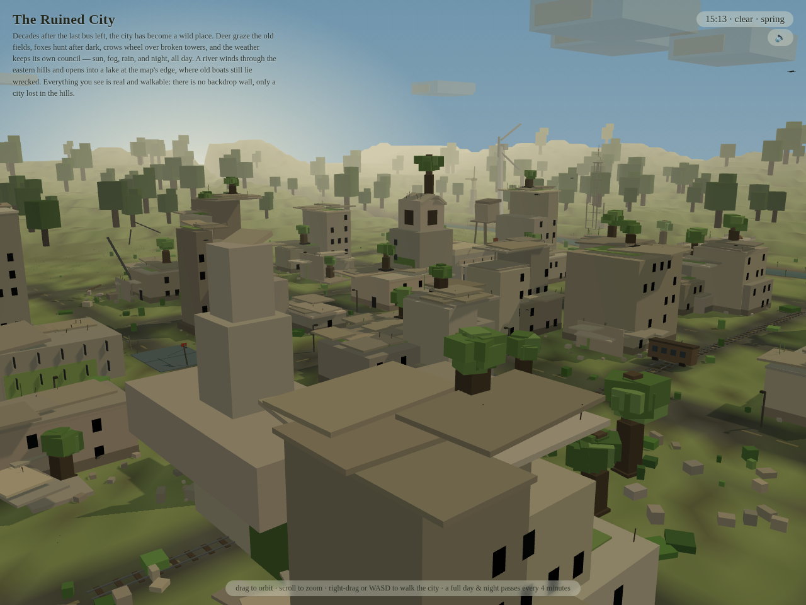
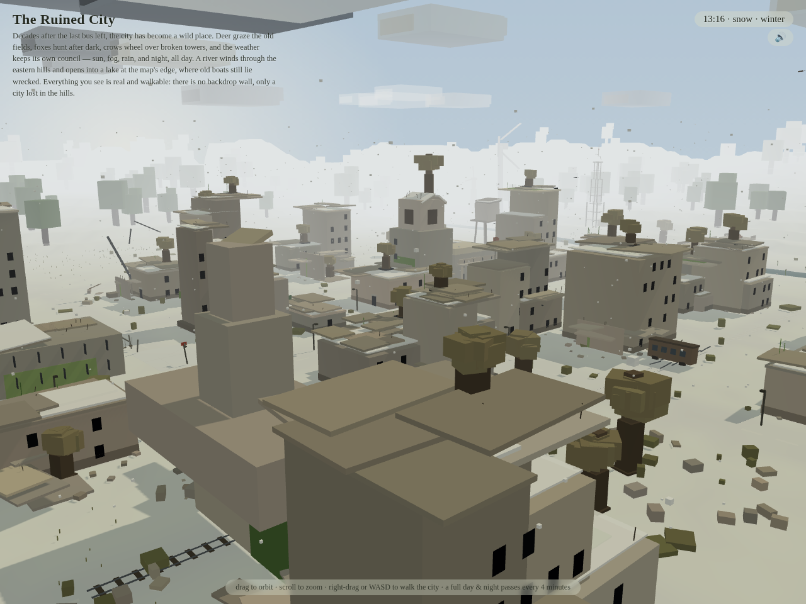
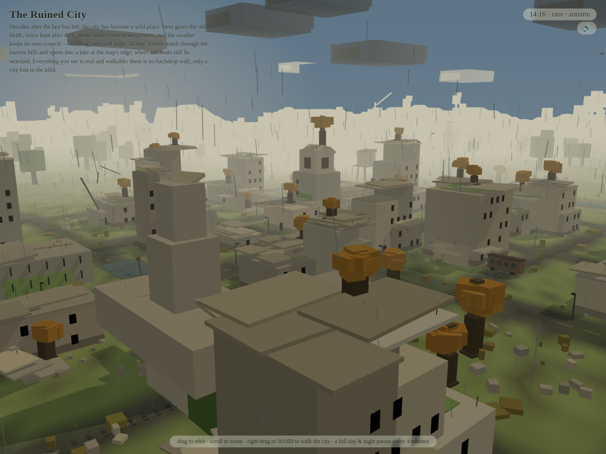
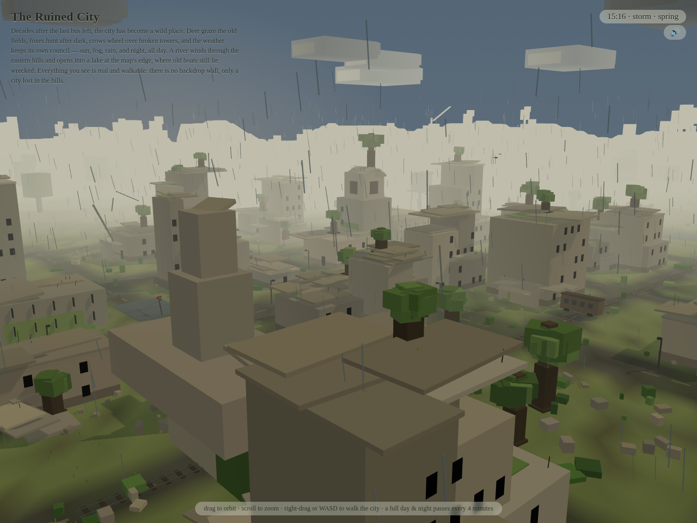
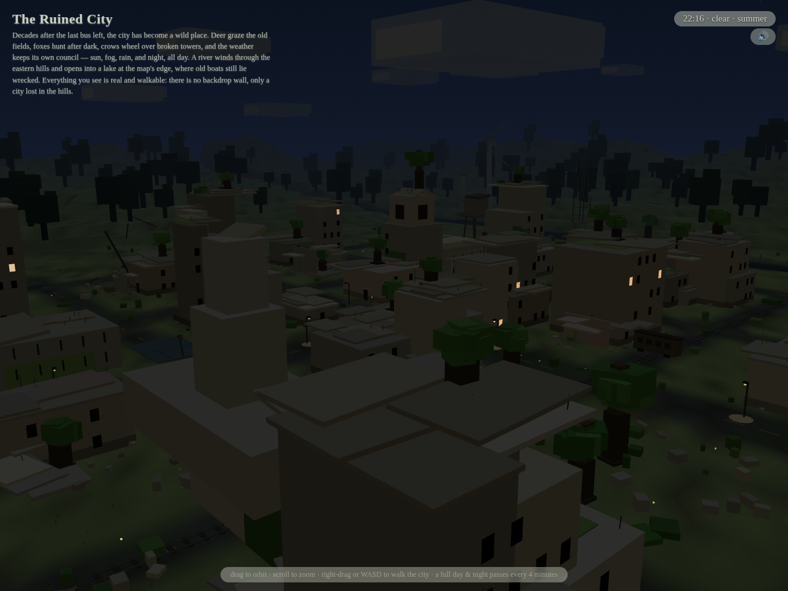
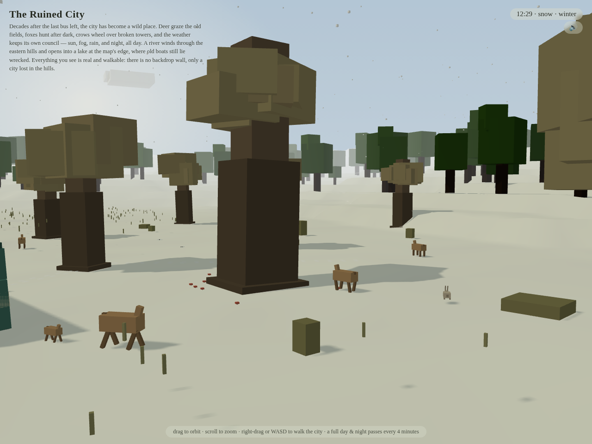

# The Ruined City — a voxel wanderer

A single-file, fully procedural voxel city that time and nature have reclaimed.
Decades after the last bus left, deer graze the old fields, foxes hunt after
dark, crows wheel over broken towers, and the weather keeps its own council —
sun, fog, rain, snow, storm and night, all day. A river winds through the
eastern hills and opens into a sea cove at the map's edge, where old boats still
lie wrecked. Everything you see is real and walkable: there is no backdrop
wall, only a city lost in the hills.

Built with [three.js](https://threejs.org/) (r160). No textures, no models,
no network — every building, tree, animal and cloud is generated at load
from seeded hashes.

| Spring | Winter |
|---|---|
|  |  |
| *Spring, afternoon.* | *Winter: roof snow caps, deer tracks, bare-brown trees.* |

| Autumn rain | Storm |
|---|---|
|  |  |
| *Autumn: rust canopies, wet ground, slanted rain.* | *Storm: dark sky, heavy slanted rain, lightning.* |

| Night (summer) | Winter meadow |
|---|---|
|  |  |
| *Summer night: lit windows, flickering lamps, fireflies.* | *Snowing in the meadow — deer and a rabbit in the drift.* |

## Run it

Just open [**ruined-city.html**](ruined-city.html) in any modern browser.
It is fully self-contained (three.js inlined) and works from `file://` —
no server needed.

**Controls** — drag to orbit · scroll to zoom · right-drag or `WASD` to walk.
A full day and night passes every four minutes; a new season each day
(spring → summer → autumn → winter).

**URL parameters** (append a hash to the URL):

| Param | Values | Effect |
|---|---|---|
| `#time=` | `0`–`24` | Starting time of day, e.g. `#time=21` |
| `#day=` | `0`–`3` | Start in a season: `0` spring, `1` summer, `2` autumn, `3` winter |
| `#wx=` | `clear` `cloudy` `fog` `rain` `snow` `storm` `blizzard` | Force the weather |
| `#cam=` | `hero` `street` `aerial` `river` `lake` `tower` `meadow` | Camera preset |
| `#snap` | — | Always use a camera preset (not just on load) |

Example: `ruined-city.html#time=13&day=3&wx=snow` — a winter afternoon in the snow.

## What's in the box

- **Procedural ruined city** — 3–9 storey concrete slabs with stepped
  footprints, broken rooflines, rubble, overgrown roofs, street-level doors,
  lintels and faded signs. Landmarks: clock tower, town hall, school, gas
  station, water tower, radio mast, lighthouse with a rotating night beam.

### Landmark tracker

Tracked so decay work doesn't drift. Positions are world (x, z) in metres.

| Landmark | Position | Status / notes |
|---|---|---|
| Clock tower | (24, −24) | Broken clock, tree on top. Reserved lot. |
| Cathedral | (−120, 80) | Ruined gothic, west meadow. Reserved lot. |
| Water tower | (88, −62) | Tilted, on its last legs (city). |
| Water tower 2 | (−6, 132) | Lone rusted tank, south meadow (deliberately isolated). |
| **Lighthouse** | (72, 195) | Banded rust rings, gallery, dome — **reads too clean for an abandoned world**: needs weathering (rust streaks, broken gallery rail, dead/dark lamp, overgrown base). Currently on the cove's west shore. |
| **Sea cliffs** | cove east shore, z ≈ 190–322 | Smooth coastal bluff opposite the lighthouse: undulating 15–30 m crest, two sea notches, layered-rock faces (fbm-wobbled strata), wave-cut toe, grassy plateau with wind-lean pines behind. Three lumpy sea stacks offshore at its foot (z ≈ 222 / 236 / 246 — the tall one stands above the northern sea notch) with animated foam rings. |
| **The sea thing** | open sea, z 355–505 | Enormous serpent (~50 m) that surfaces only at night, now and then breaking the surface for a few seconds before diving. Random patrol, uncatchable — ambient presence, not a visitable landmark. |
| **The Old Ring** | (≈283, 247) plateau behind the sea cliffs | Neolithic stone circle: 8 mossy menhirs (one fallen outside the ring, one snapped into stump + leaning capstone), a broken two-slab altar in the middle. A turf barrow with a stone ring + leaning sentinel (≈303, 285) and scattered fallen slabs nearby. Stones are fbm-wobbled cylinders with vertex-coloured weathering (damp base, sun-bleached crowns, moss, lichen) — weathered monoliths, not blocks. Far older than the city. The two far-hill slabs that used to squat at the NE map edge are skipped instead; the sector is now a dark evergreen grove much thicker than the hill forest, with the ring + barrow in open clearings. |
| Radio mast | — | Thin mast on the skyline. |
| Ferris wheel | — | Rust-red, east of town. |
| Boat graveyard | cove shore | Beached wrecks + sunken hull + ruined jetty. |
- **Living landscape** — hero trees that sway, grass tufts that bend, a
  meandering river, a sea cove with lily pads and wrecked boats, reeds,
  wildflowers, mushrooms, fallen logs, and the Old Ring — a Neolithic
  stone circle and barrow in a dark evergreen grove behind the sea cliffs.
- **Day/night** — 24 h cycle in 4 real minutes: sunrise, dusk, moonlit night,
  lit windows, streetlamps that flicker at dusk, a few that sputter back to
  life, lighthouse beam, stars and shooting stars on clear nights.
- **Seasons** — one season per in-game day. Foliage, grass, bushes and
  wildflowers ease to seasonal palettes; flowers die back in winter. Weather
  rolls are weighted per season: no snow in summer, blizzards only in winter,
  snow likelier in winter than anywhere else.
- **Weather** — clear, cloudy, fog, rain (per-drop length/slant variance),
  snow (falling + accumulating ground/roof/landmark caps), storm (darker sky,
  heavier rain, lightning flashes), blizzard (winter whiteout: dense fog to
  ~120 m, driving snow that falls and blows harder, near-gale wind).
- **Wildlife** — deer, rabbits, foxes and crows roam; gulls wheel the cove by
  day (lazy glides, stoops to the water, a few roosting on the sea stacks —
  gone by dusk and in blizzards); fireflies on clear
  summer nights; autumn leaves drift down; snow footprints: a deer trail from
  the meadow into town and a fox trail along the avenue.
- **Procedural ambient audio** — WebAudio wind, rain, water, thunder,
  daytime birds, night crickets; the water channel fades with your distance
  to the river/cove. Mute with the toggle in the top-right. (Audio starts on
  your first click, per browser autoplay rules.)

## Development

The source of truth is `ruined-city.src.html` (a module script that imports
three.js). `ruined-city.html` is the built standalone file — don't edit it
by hand.

```sh
node build-standalone.mjs ruined-city.src.html ruined-city.html
```

The build inlines `three.module.js` + `controls/OrbitControls.js` into
classic `<script>` blocks so the result works from `file://` with zero
network.

The scene is inspectable at runtime: `__RC_DEBUG__()` in the console returns
`{ simDay, hour, season, wx, snowfall, snowGround }`.

## Files

| File | Purpose |
|---|---|
| `ruined-city.html` | Built standalone — just open it |
| `ruined-city.src.html` | Source (module imports; edit this) |
| `build-standalone.mjs` | Inlines three.js → standalone build |
| `three.module.js`, `controls/OrbitControls.js` | Vendored three.js r160 (build inputs) |
| `screenshots/` | Headless-Chromium captures used in this README |

## License

[MIT](LICENSE)
